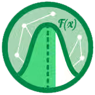

<a href="https://platzi.com/cursos/estadistica-descriptiva/">

<h1 align="center"><a href="https://platzi.com/cursos/estadistica-descriptiva/">Curso de Matemáticas para Data Science: Estadística Descriptiva</a></h1>

  

  Este proyecto fue hecho en VS Code con Jupyter Notebooks. Por
    <a href="https://github.com/DensLopez">Dennis.</a>
  

 
 

Este repositorio está relacionado al curso de <a href="https://platzi.com/cursos/estadistica-descriptiva/">"Curso de Matemáticas para Data Science: Estadística Descriptiva"</a> tomado en <a href="https://platzi.com">Platzi.</a> Además, contiene archivos ["ipynb"](codes), ["html"](codes/html/) y ["pdf"](codes/pdfs/) con los códigos desarrollados en el curso y explicaciones por cada archivo.
 

<h1 align="center">Acerca de </h1>
La estadística descriptiva es una de la herramientas fundamentales para cualquier científico de datos. En este curso aprenderás a entender los principales conceptos de esta rama, desarrollar gráficas a través de datos y aplicar estadística para un análisis profundo. Todo esto acompañado de ejercicios con Deepnote y Python.

 

## Temario

### ¿Para qué sirve la estadística descriptiva?

- Estadística descriptiva vs inferencial - [code001.ipynb](codes/code001.ipynb), [code001.pdf](codes/pdfs/code001.pdf).
- Flujo de trabajo en Data Science - [code002.ipynb](codes/code002.ipynb), [code002.pdf](codes/pdfs/code002.pdf).
- Plan del curso - [code003.ipynb](codes/code003.ipynb), [code003.pdf](codes/pdfs/code003.pdf).

### Estadística descriptiva analítica

- ¿Cómo usar deep note? - [code004.ipynb](codes/code004.ipynb), [code004.pdf](codes/pdfs/code004.pdf).
- Tipos de datos - [code005.ipynb](codes/code005.ipynb), [code005.pdf](codes/pdfs/code005.pdf).
- Medidas de tendencia central - [code006.ipynb](codes/code006.ipynb), [code006.pdf](codes/pdfs/code006.pdf).
- Métafora de Bill Gates en un bar - [code007.ipynb](codes/code007.ipynb), [code007.pdf](codes/pdfs/code007.pdf).
- Medidas de tendencia central en Python [Reto] - [code008.ipynb](codes/code008.ipynb), [code008.pdf](codes/pdfs/code008.pdf).
- Medidas de dispersión - [code009.ipynb](codes/code009.ipynb), [code009.pdf](codes/pdfs/code009.pdf).
- Desviación estándar - [code010.ipynb](codes/code010.ipynb), [code010.pdf](codes/pdfs/code010.pdf).
- Medidas de dispersión en Python - [code011.ipynb](codes/code011.ipynb), [code011.pdf](codes/pdfs/code011.pdf).
- Exploración visual de datos - [Extra01.ipynb](codes/Extra01.ipynb), [Extra01.pdf](codes/pdfs/Extra01.pdf).
- Diagramas de dispersión en el análisis de datos [Reto] - [code012.ipynb](codes/code012.ipynb), [code012.pdf](codes/pdfs/code012.pdf).

### Estadística en la ingesta de datos

- Pipelines de procesamiento - [code013.ipynb](codes/code013.ipynb), [code013.pdf](codes/pdfs/code013.pdf).
- Transformación no lineal - [code014.ipynb](codes/code014.ipynb), [code014.pdf](codes/pdfs/code014.pdf).
- Procesamiento de datos numéricos en Python [Reto] - [code015.ipynb](codes/code015.ipynb), [code015.pdf](codes/pdfs/code015.pdf).
- Pipelines de procesamiento para variables categóricas - [code016.ipynb](codes/code016.ipynb), [code016.pdf](codes/pdfs/code016.pdf).
- Procesamiento para variables categóricas con Python [Reto] - [code017.ipynb](codes/code017.ipynb), [code017.pdf](codes/pdfs/code017.pdf).
- Correlaciones - [code018.ipynb](codes/code018.ipynb), [code018.pdf](codes/pdfs/code018.pdf).
- Matriz de covarianza - [code019.ipynb](codes/code019.ipynb), [code019.pdf](codes/pdfs/code019.pdf).

### Proyecto de aplicación

- Cálculo de valores propios de una matriz - [code020.ipynb](codes/code020.ipynb), [code020.pdf](codes/pdfs/code020.pdf).
- PCA: Análisis de componentes principales - [code021.ipynb](codes/code021.ipynb), [code021.pdf](codes/pdfs/code021.pdf).
- Reducción de dimensionalidad con PCA - [code022.ipynb](codes/code022.ipynb), [code022.pdf](codes/pdfs/code022.pdf).

### Despedida

- Conclusiones - [code023.ipynb](codes/code023.ipynb), [code023.pdf](codes/pdfs/code023.pdf).
- Examen final - [Examn.pdf](codes/pdfs/Examen.pdf)

 
